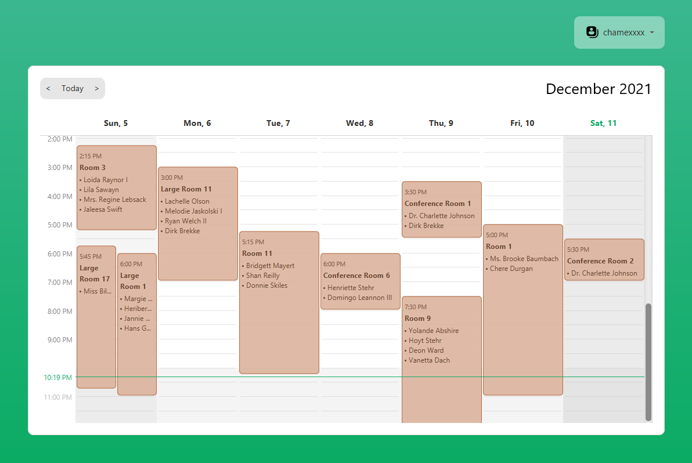

# Meeting Room Booking System

> Desktop application for booking meeting rooms



## How to build

Install a valid Java 11 version, and set JAVA_HOME accordingly.

### Gradle Commands

Run in place

```bash
./gradlew run
```

Run in place and generate fake data 

```bash
./gradlew run --args="--generate-fake-data"
```

To build the project

```bash
./gradlew build
```

Build a distribution zip in `build/distributions`

```bash
./gradlew distZip
```

## Built with

* JDK 11
* Gradle
* IntelliJ IDEA

## License

The code is available under the [MIT](LICENSE) license.

The logo icon is made by <a href="https://www.freepik.com" title="Freepik">Freepik</a>
from <a href="https://www.flaticon.com/" title="Flaticon">www.flaticon.com</a>

